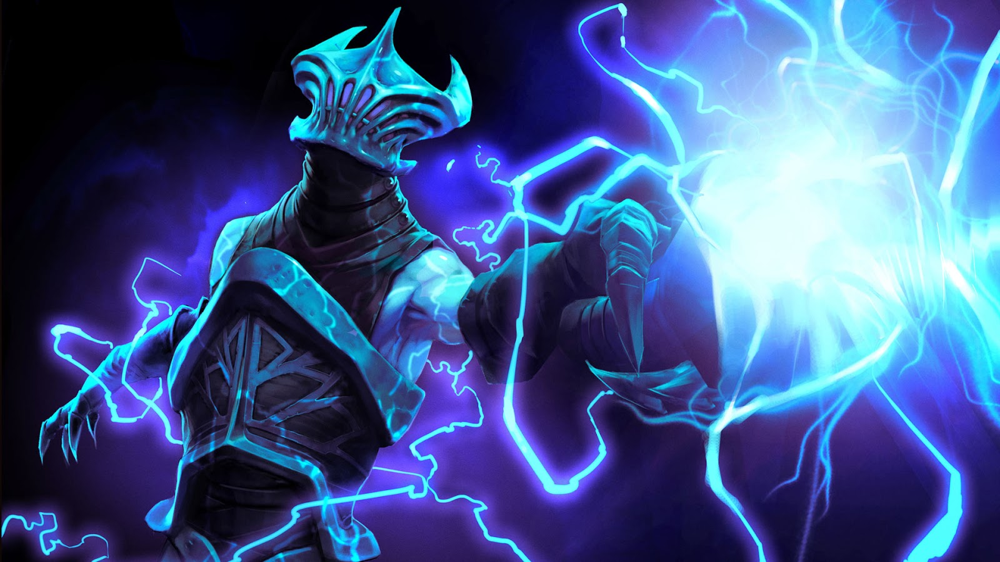

# Razor 

Razor is a development framework writing in [zig][ziglang] for creating smart contract for Nervos' CKB layer 1 blockchain. Razor is designed to provide an out-of-the-box solution that helps Nervos developers accomplish common tasks quickly and painlessly.

## TODO
* [x] Use ckb syscall
* [x] Use FixedBufferAllocator
* [x] Add all syscalls
* [ ] Add all helper function in [`ckb-std`][ckb-std]
  - high level syscall
  - simulator
  - common data types (ckb-types/since/...)
  - error types
  - dynamic loading
* [ ] Choose a better allocator and a heap size
* [ ] An example to wrap a relatively complex C library
  - secp256k1
* [ ] Port [anyone can pay][anyone-can-pay] type script
* [ ] Add test library ([`ckb-testtool`][ckb-testtool])
* [ ] Add Command line tool to manage the project
  - create project
  - deploy binary (with migration support)
  - [`ckb-debugger`][ckb-debugger] integration
  - [`ckb-binary-pather`][ckb-binary-pather] integration
* [ ] A tutorial to help user quick start

[ziglang]: https://ziglang.org/
[capsule]: https://github.com/nervosnetwork/capsule
[ckb-std]: https://github.com/nervosnetwork/ckb-std
[ckb-testtool]: https://github.com/nervosnetwork/ckb-tool/tree/master/testtool
[ckb-debugger]: https://github.com/nervosnetwork/ckb-standalone-debugger
[ckb-binary-pather]: https://github.com/nervosnetwork/ckb-binary-patcher
[anyone-can-pay]: https://github.com/nervosnetwork/ckb-production-scripts/blob/6638022cb4768911d41d4bc3fc5a5e2a29b38476/c/anyone_can_pay.c
